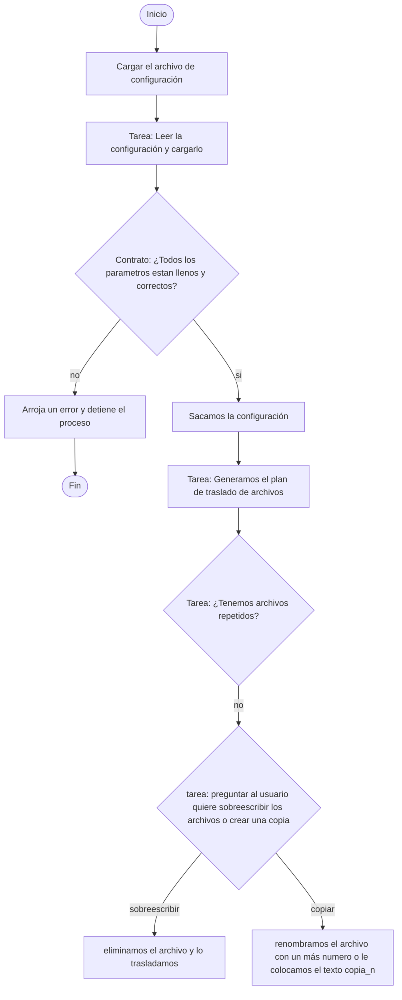

# Documentación de técnica Automatización de archivos
Bienvenido a la documentación de técnica de Automatización de archivos. En esta documentación orientada para desarrolladores de se explica el proceso de desarrollo de un proyecto de software de manera sencilla y eficiente.

## Proceso general

